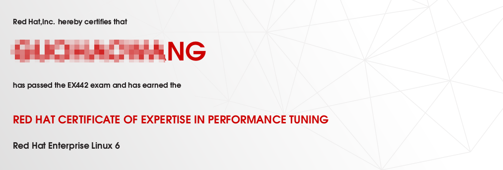
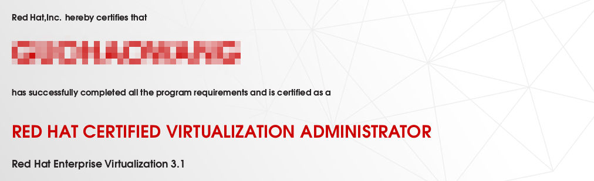
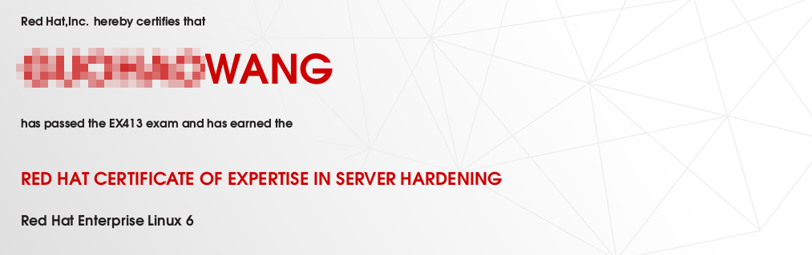
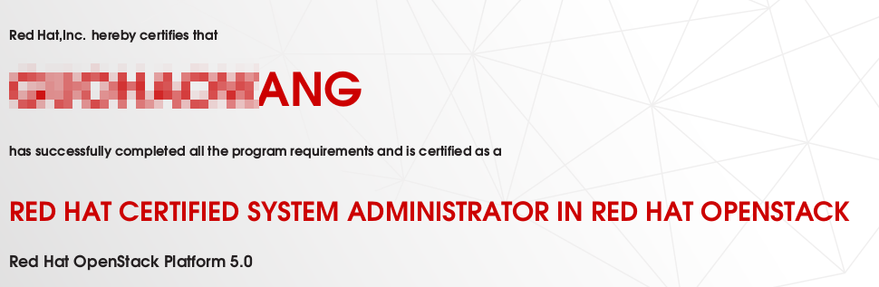

###0x00 前言
RHCA作为一个高级IT认证,就是认证难度来说中等,就课程内容来说很多并不是开源界标准方案,毕竟这是厂商认证也可以理解. 
本人学习的如下五门课程,redhat现在推出17门认证,任意五门通过即为RHCA. 
课程号称架构师,虽然课程难度不高,所以这个名头有点虚,不过值得说道的是课程的确是以一个架构师的视角,即架构实现.课程没有拘泥太多细节而是让学员认识技术堆栈的优缺点,不过很多地方依然是厂商特色.
###0x01 442

442课程主要讲解的是性能调优和监控,依赖扎实操作系统理论知识.
###0x02 318

318课程主要讲的虚拟化,在3.1平台时候已经使用kvm作为底层驱动,就虚拟化本身而言并不如vmware.
###0x03 413

413课程服务硬化,主要关注系统级别的安全,做整体安全方案还可以.但是对细节要求不如333课程里面针对特别服务进行加固实在.
###0x04 210

210课程openstack,概览了openstack架构,依赖与puppet进行安装,课程主要培养的openstack用户,对每个组件的基本架构仅仅做了介绍,且实验了一部分使用,难度太低.
###0x05 436
436存储和集群,难度一般.没有讲业界的lvs,而是使用redhat的ha套件,包括ricci,luci等,存储使用gfs2,也是user角度去选择技术堆栈.
